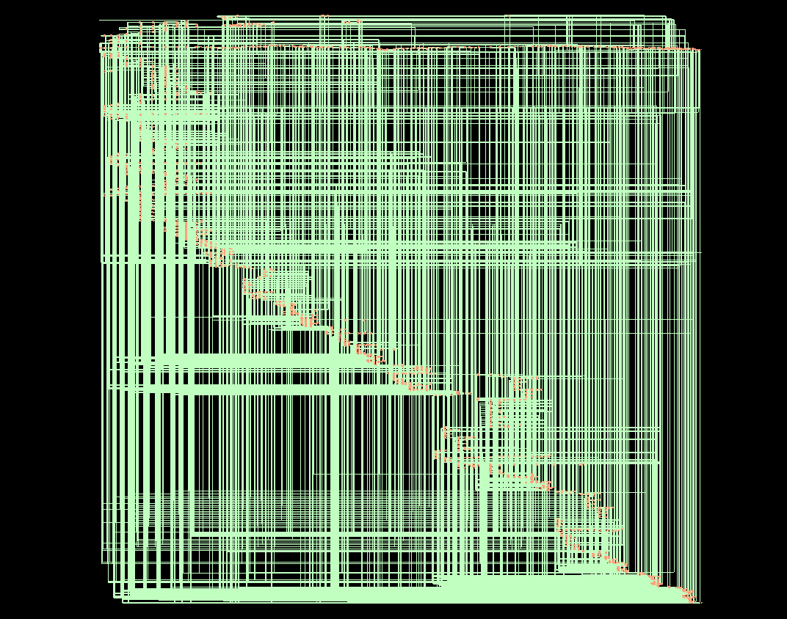
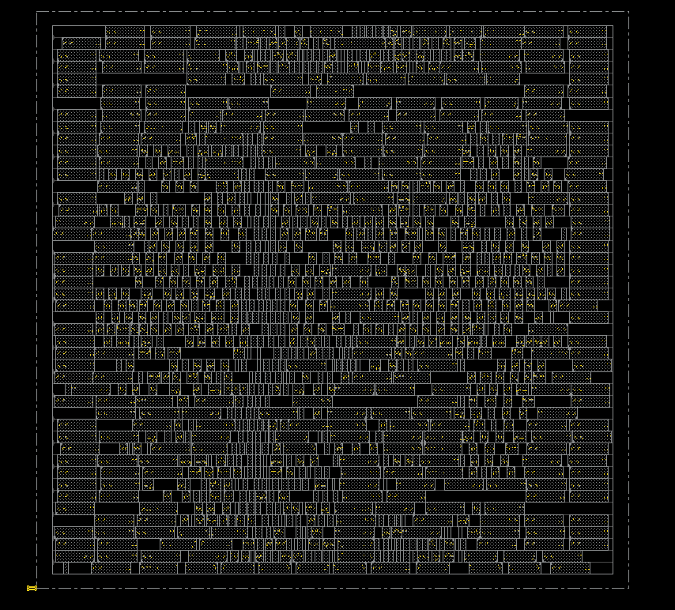
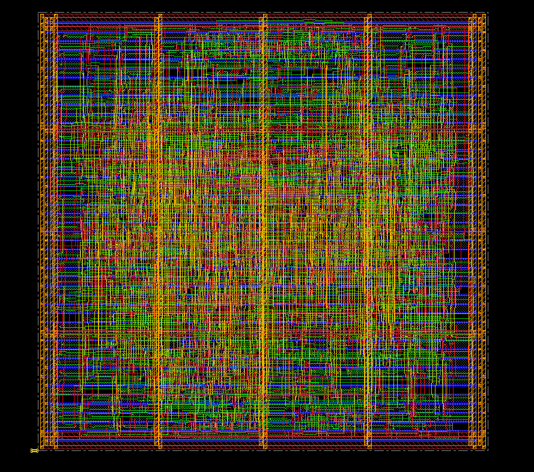
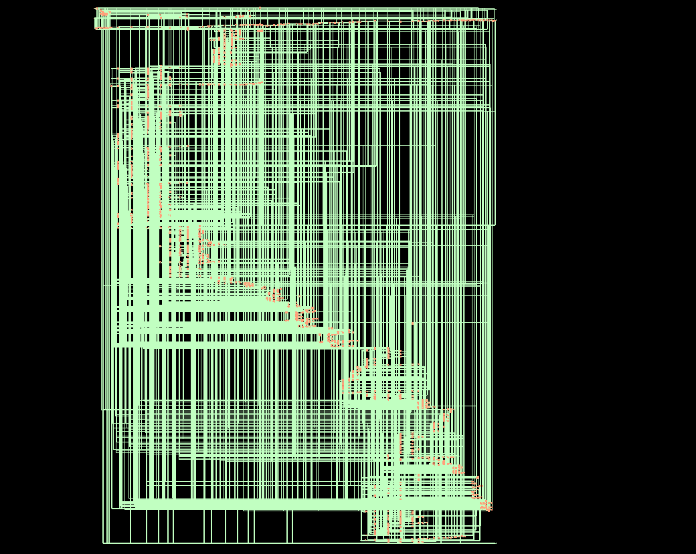
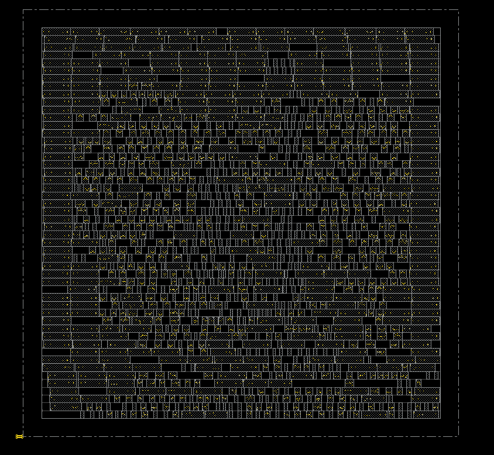
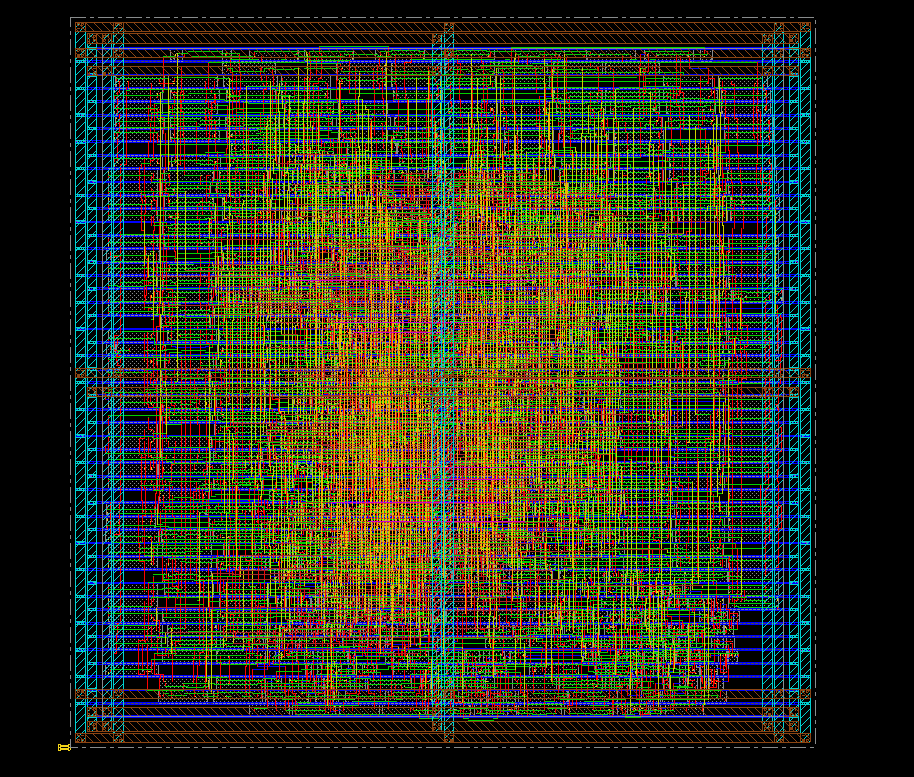

# 8-Bit Processor: RTL-to-GDSII Implementation Using Cadence Design Suite

<div align="center">


*A complete accumulator-based 8-bit processor with custom ISA and full ASIC design flow implementation*

[Introduction](#-introduction) • [Architecture](#-architecture) • [ISA](#-instruction-set) • [Performance](#-performance) • [Setup](#-setup)

---

## 🖼️ Design Visualizations

This section presents key visual stages of the physical implementation for both 180nm and 90nm CMOS technologies.

---

### 180nm Technology Implementation

#### 1. Gate-Level Schematic (180nm)


*Post-synthesis gate-level schematic showing 1229 standard cells, processor datapath, ALU integration, and memory array interconnections*


#### 2. No Layout View (180nm)


*Initial view before placement and routing - shows bare floorplan or empty die area ready for standard cell placement*


#### 3. Complete Layout (180nm)


*Finished physical layout with complete placement, routing across all metal layers (M1-M4), power distribution, and fabrication-ready GDSII*


### 90nm Technology Implementation

#### 1. Gate-Level Schematic (90nm)


*Post-synthesis gate-level schematic with 1209 optimized standard cells, showing higher logic density and tighter integration compared to 180nm*


#### 2. No Layout View (90nm)


*Initial view showing empty floorplan with 3.16× smaller die area compared to 180nm, ready for high-density placement*


#### 3. Complete Layout (90nm)


*Complete physical layout with high-density placement, advanced multi-layer routing (M1-M6), optimized power mesh, and fabrication-ready GDSII*


### Technology Comparison - Layout Summary

<div align="center">

| **Aspect** | **180nm Technology** | **90nm Technology** | **Improvement** |
|:----------:|:--------------------:|:-------------------:|:---------------:|
| **Die Area** | 38429.900 μm² | 12153.543 μm² | **3.16× smaller** |
| **Cell Count** | 1229 cells | 1209 cells | Similar complexity |
| **Layout Density** | Lower (easier routing) | Higher (tighter packing) | More compact |
| **Metal Layers** | M1-M4 (4 layers) | M1-M6 (6 layers) | More flexibility |
| **Cell Size (avg)** | 31.27 μm²/cell | 10.05 μm²/cell | **3.11× smaller** |
| **Routing Complexity** | Moderate | Higher | Advanced tools needed |
| **Via Count** | Lower | Higher | More interconnect layers |
| **Power Grid Pitch** | Wider | Finer | Better distribution |
| **DRC/LVS Status** | ✅ Clean | ✅ Clean | Both fabrication-ready |

</div>

---

### Layout Design Characteristics

```
┌────────────────────────────────────────────────────────┐
│           LAYOUT CHARACTERISTICS SUMMARY               │
├────────────────────────────────────────────────────────┤
│                                                         │
│  180nm Technology:                                      │
│  ✓ Larger die area (38430 μm²)                         │
│  ✓ Relaxed design rules (easier DRC closure)           │
│  ✓ 4 metal layers sufficient (M1-M4)                   │
│  ✓ Lower routing density and congestion                │
│  ✓ Simpler via structures                              │
│  ✓ Mature design methodology and tools                 │
│  ✓ Lower mask cost per wafer                           │
│  ✓ Excellent for low-leakage applications              │
│                                                         │
│  90nm Technology:                                       │
│  ✓ Compact die area (12154 μm²) - 3.16× smaller        │
│  ✓ Stringent design rules (advanced DRC/LVS)           │
│  ✓ 6 metal layers utilized (M1-M6)                     │
│  ✓ Higher routing density - optimized placement        │
│  ✓ Complex via stacks for multi-layer routing          │
│  ✓ Advanced optimization techniques required           │
│  ✓ Higher performance capability (100 MHz)             │
│  ✓ Better for area-constrained, high-speed designs     │
│                                                         │
│  Both Technologies Achieve:                             │
│  ✅ DRC Clean (0 violations)                           │
│  ✅ LVS Clean (100% netlist match)                     │
│  ✅ Timing constraints met (positive slack)            │
│  ✅ Power grid verified and robust                     │
│  ✅ Fabrication-ready GDSII generated                  │
│  ✅ Production-quality layouts                         │
│                                                         │
└────────────────────────────────────────────────────────┘
```

---

</div>

## 📌 Introduction

This repository presents a **complete RTL-to-GDSII implementation** of an 8-bit accumulator-based processor, designed from scratch with a custom instruction set architecture. The processor demonstrates fundamental concepts of computer architecture including fetch-decode-execute cycles, memory-mapped operations, and arithmetic-logic unit integration.

### 🎯 Project Highlights

- 💡 **Custom ISA**: 4 instruction types with 7 ALU operations
- 🔬 **Accumulator Architecture**: Simple, efficient single-register design
- 📐 **3-Stage Pipeline**: Fetch → Execute → Writeback FSM
- ✅ **Unified Memory**: 32-byte Von Neumann architecture
- 🏆 **Full ASIC Flow**: Synthesis through layout in 90nm/180nm
- ⚡ **Status Flags**: Carry and Zero flag support
- 🎓 **Educational Focus**: Clear, well-documented teaching implementation

---

## 🏗️ Architecture

### System Block Diagram

```
┌─────────────────────────────────────────────────────────────────┐
│                    8-BIT PROCESSOR ARCHITECTURE                  │
└─────────────────────────────────────────────────────────────────┘

                              ┌──────────┐
                              │   CLK    │
                              │  RESET   │
                              └────┬─────┘
                                   │
        ┌──────────────────────────┼──────────────────────────┐
        │                          │                          │
        │              ┌───────────▼──────────┐              │
        │              │    CONTROL UNIT      │              │
        │              │   (3-State FSM)      │              │
        │              │  ┌────────────────┐  │              │
        │              │  │ FETCH  (00)    │  │              │
        │              │  │ EXEC   (01)    │  │              │
        │              │  │ WB     (10)    │  │              │
        │              │  └────────────────┘  │              │
        │              └───────────┬──────────┘              │
        │                          │                          │
        │         ┌────────────────┼────────────────┐        │
        │         │                │                │        │
        │    ┌────▼─────┐    ┌────▼────┐    ┌─────▼────┐   │
        │    │    PC    │    │   IR    │    │  STATE   │   │
        │    │  [4:0]   │    │  [7:0]  │    │  [1:0]   │   │
        │    └────┬─────┘    └────┬────┘    └──────────┘   │
        │         │               │                          │
        │         └───────┬───────┘                          │
        │                 │                                  │
        │         ┌───────▼────────┐                         │
        │         │  MEMORY ARRAY  │                         │
        │         │   32 x 8-bit   │                         │
        │         │  [0:31] bytes  │                         │
        │         └───────┬────────┘                         │
        │                 │                                  │
        │     ┌───────────┼───────────┐                     │
        │     │           │           │                     │
        │ ┌───▼───┐   ┌──▼───┐   ┌───▼────┐               │
        │ │   A   │   │ ALU  │   │ alu_b  │               │
        │ │ [7:0] │───┤  B   │◄──┤ [7:0]  │               │
        │ └───┬───┘   └──┬───┘   └────────┘               │
        │     │          │                                  │
        │     │    ┌─────▼──────┐                          │
        │     │    │    ALU     │                          │
        │     │    │  (7 ops)   │                          │
        │     │    │ ┌────────┐ │                          │
        │     │    │ │ ADD    │ │  ┌──────────┐           │
        │     │    │ │ SUB    │ │  │ CARRY    │           │
        │     │    │ │ AND    │ ├──┤ ZERO     │           │
        │     │    │ │ OR     │ │  └──────────┘           │
        │     │    │ │ INC    │ │                          │
        │     │    │ │ DEC    │ │                          │
        │     │    │ │ NOT    │ │                          │
        │     │    │ └────────┘ │                          │
        │     │    └─────┬──────┘                          │
        │     │          │                                  │
        │     └──────────┘                                  │
        │                                                    │
        │         ┌──────────────┐                          │
        │         │   OUTPUTS    │                          │
        │         │  A_out[7:0]  │                          │
        │         │  PC_out[4:0] │                          │
        │         │  halted_out  │                          │
        │         └──────────────┘                          │
        └────────────────────────────────────────────────────┘
```

### Processor Specifications

| **Parameter** | **Specification** |
|:--------------|:------------------|
| **Architecture Type** | Accumulator-based |
| **Memory Model** | Von Neumann (unified) |
| **Data Width** | 8 bits |
| **Address Space** | 32 bytes (5-bit addressing) |
| **Instruction Format** | Variable length (1-2 bytes) |
| **Registers** | A (Accumulator), PC, IR |
| **Status Flags** | Carry, Zero |
| **FSM States** | 3 (Fetch, Execute, Writeback) |
| **ALU Operations** | 7 (ADD, SUB, AND, OR, INC, DEC, NOT) |
| **Control Inputs** | CLK, RESET |
| **Outputs** | A_out[7:0], PC_out[4:0], halted_out |

---

## 📚 Instruction Set Architecture

### Instruction Format

```
┌─────────────────────────────────────┐
│     INSTRUCTION FORMAT (8 bits)     │
├─────────────────────────────────────┤
│  [7:5]  │         [4:0]             │
│ OPCODE  │   ADDRESS / OPERAND       │
│ 3 bits  │        5 bits             │
└─────────────────────────────────────┘
```

### Complete Instruction Set

| **Opcode** | **Mnemonic** | **Format** | **Operation** | **Description** | **Cycles** |
|:----------:|:------------:|:----------:|:--------------|:----------------|:----------:|
| **000** | LOAD | LOAD addr | A ← M[addr] | Load memory into accumulator | 2 |
| **001** | STORE | STORE addr | M[addr] ← A | Store accumulator to memory | 2 |
| **010** | ALU | ALU op, addr | A ← A op M[M[PC+1]] | ALU operation with memory operand | 3 |
| **111** | HALT | HALT | Stop execution | Halt processor operation | 1 |

### ALU Operation Encoding (op[2:0])

| **op[2:0]** | **Operation** | **Function** | **Flags Updated** | **Description** |
|:-----------:|:-------------:|:-------------|:-----------------:|:----------------|
| **000** | ADD | A + B | Carry, Zero | Addition with carry output |
| **001** | SUB | A - B | Carry (Borrow), Zero | Subtraction with borrow flag |
| **010** | AND | A & B | Zero | Bitwise AND operation |
| **011** | OR | A \| B | Zero | Bitwise OR operation |
| **100** | INC | A + 1 | Carry, Zero | Increment accumulator |
| **101** | DEC | A - 1 | Carry, Zero | Decrement accumulator |
| **110** | NOT | ~A | Zero | Bitwise NOT (complement) |
| **111** | — | — | — | Reserved |

### Instruction Encoding Examples

```assembly
; Example 1: Load value from memory location 16
0001_0000  →  LOAD M[16]

; Example 2: Add value from indirect address
010_000_00  →  ALU ADD (operand address in next byte)
0001_0001   →  Address 17

; Example 3: Store result to memory location 18
0011_0010  →  STORE M[18]

; Example 4: Halt execution
1110_0000  →  HALT
```

---

## 🔄 Execution Model

### FSM State Diagram

```
                    ┌──────────────┐
                    │              │
                    │    RESET     │
                    │              │
                    └──────┬───────┘
                           │
                           ▼
                  ┌────────────────┐
           ┌──────┤  FETCH (00)    ◄──────┐
           │      │                │       │
           │      │  IR ← M[PC]    │       │
           │      └────────┬───────┘       │
           │               │               │
           │               ▼               │
           │      ┌────────────────┐       │
           │      │  EXEC (01)     │       │
           │      │                │       │
           │      │ Decode & Exec  │       │
           │      └────────┬───────┘       │
           │               │               │
           │               │               │
           │      ┌────────▼───────┐       │
           │      │ Is ALU instr?  │       │
           │      └────┬───────┬───┘       │
           │           │       │           │
           │          NO      YES          │
           │           │       │           │
           │           │       ▼           │
           │           │  ┌────────────┐   │
           │           │  │  WB (10)   │   │
           │           │  │            │   │
           │           │  │ A ← ALU    │   │
           │           │  │ Flags ← F  │   │
           │           │  └──────┬─────┘   │
           │           │         │         │
           └───────────┴─────────┴─────────┘
                (If not HALT)
```

### Execution Cycles

#### 1. LOAD Instruction (2 cycles)
```
Cycle 1 (FETCH):  IR ← M[PC]
Cycle 2 (EXEC):   A ← M[IR[4:0]], PC ← PC + 1
```

#### 2. STORE Instruction (2 cycles)
```
Cycle 1 (FETCH):  IR ← M[PC]
Cycle 2 (EXEC):   M[IR[4:0]] ← A, PC ← PC + 1
```

#### 3. ALU Instruction (3 cycles)
```
Cycle 1 (FETCH):  IR ← M[PC]
Cycle 2 (EXEC):   alu_op ← IR[4:2], alu_b ← M[M[PC+1]], next_pc ← PC + 2
Cycle 3 (WB):     A ← ALU_result, Carry ← carry, Zero ← zero, PC ← next_pc
```

#### 4. HALT Instruction (1 cycle)
```
Cycle 1 (FETCH):  IR ← M[PC]
Cycle 2 (EXEC):   halted ← 1, Stop execution
```

---

## 💻 Example Programs

### Program 1: Addition (Default Demo)

```assembly
; Program: Add two numbers from memory
; Location: Memory initialized at reset

Address  | Instruction      | Encoding    | Comment
---------|------------------|-------------|---------------------------
0x00     | LOAD M[16]       | 000_10000   | Load first operand
0x01     | ALU ADD          | 010_000_00  | Prepare ADD operation
0x02     | 17               | 0001_0001   | Address of second operand
0x03     | STORE M[18]      | 001_10010   | Store result
0x04     | HALT             | 111_00000   | Stop execution
...
0x10     | DATA: 10         | 0000_1010   | First number (A = 10)
0x11     | DATA: 5          | 0000_0101   | Second number (B = 5)
0x12     | RESULT: 0        | 0000_0000   | Result location (15)
```

**Expected Output:**
- `M[18] = 15` (10 + 5)
- `Carry = 0`, `Zero = 0`

### Program 2: Logical Operations

```assembly
; Program: Perform AND and OR operations

Address  | Instruction      | Encoding    | Comment
---------|------------------|-------------|---------------------------
0x00     | LOAD M[16]       | 000_10000   | Load 0xFF
0x01     | ALU AND          | 010_010_00  | AND with M[17]
0x02     | 17               | 0001_0001   | Address 17
0x03     | STORE M[18]      | 001_10010   | Store AND result
0x04     | LOAD M[16]       | 000_10000   | Reload 0xFF
0x05     | ALU OR           | 010_011_00  | OR with M[19]
0x06     | 19               | 0001_0011   | Address 19
0x07     | STORE M[20]      | 001_10100   | Store OR result
0x08     | HALT             | 111_00000   | Stop
...
0x10     | DATA: 0xFF       | 1111_1111   | First operand
0x11     | DATA: 0x0F       | 0000_1111   | Second operand (AND)
0x12     | RESULT_AND       | 0000_0000   | AND result (0x0F)
0x13     | DATA: 0x00       | 0000_0000   | Third operand (OR)
0x14     | RESULT_OR        | 0000_0000   | OR result (0xFF)
```

### Program 3: Counter (INC/DEC)

```assembly
; Program: Increment counter 5 times

Address  | Instruction      | Encoding    | Comment
---------|------------------|-------------|---------------------------
0x00     | LOAD M[16]       | 000_10000   | Load counter (0)
0x01     | ALU INC          | 010_100_00  | Increment
0x02     | 00               | 0000_0000   | (dummy address)
0x03     | ALU INC          | 010_100_00  | Increment again
0x04     | 00               | 0000_0000   | 
0x05     | ALU INC          | 010_100_00  | Increment again
0x06     | 00               | 0000_0000   | 
0x07     | ALU INC          | 010_100_00  | Increment again
0x08     | 00               | 0000_0000   | 
0x09     | ALU INC          | 010_100_00  | Increment again
0x0A     | 00               | 0000_0000   | 
0x0B     | STORE M[17]      | 001_10001   | Store result (5)
0x0C     | HALT             | 111_00000   | Stop
...
0x10     | DATA: 0          | 0000_0000   | Initial counter
0x11     | RESULT: 0        | 0000_0000   | Final count (5)
```

---

## 📈 Performance Analysis

### Technology Comparison - Complete Results

| **Metric** | **Unit** | **180nm Technology** | **90nm Technology** | **Improvement** |
|:-----------|:--------:|:--------------------:|:-------------------:|:---------------:|
| **Total Cell Area** | μm² | 38429.900 | 12153.543 | **3.16× smaller** |
| **Total Cell Count** | cells | 1229 | 1209 | 1.7% fewer |
| **Sequential Area** | % | 62.9% | 60.1% | Similar ratio |
| **Logic Area** | % | 35.9% | 38.7% | More logic density |
| **Critical Path Delay** | ps | 7457 | 3609 | **2.07× faster** |
| **Clock Period** | ps | 20000 (20 ns) | 10000 (10 ns) | **2.0× higher freq** |
| **Setup Slack** | ps | 12168 | 6248 | Both excellent |
| **Max Frequency** | MHz | ~50 | ~100 | **2.0× faster** |
| **Total Power** | mW | 1.678 | 0.857 | **1.96× lower** |
| **Leakage Power** | % | 0.06% | 6.81% | 113× higher (trade-off) |
| **Register Power** | mW | 1.302 | 0.690 | 1.89× lower |

### Synthesis Results - 90nm Technology

```
╔════════════════════════════════════════════╗
║       SYNTHESIS SUMMARY (90nm CMOS)        ║
╠════════════════════════════════════════════╣
║  Technology Node    : 90nm                 ║
║  Synthesis Tool     : Cadence Genus 20.11  ║
║  Operating Mode     : Balanced Tree        ║
║  Total Cell Count   : 1209 cells           ║
║  Total Cell Area    : 12153.543 μm²        ║
║  Net Area           : 0.000 μm²            ║
║  Total Area         : 12153.543 μm²        ║
║  Timing Slack       : 6248 ps (MET)        ║
║  Max Frequency      : ~100 MHz             ║
╚════════════════════════════════════════════╝
```

### Cell Distribution - 90nm

| Cell Type | Area % | Notes |
|:---------:|:------:|:------|
| Sequential (Registers) | 60.1% | Dominated by 32x8 memory array |
| Combinational Logic | 38.7% | ALU and control logic |
| Physical Cells | 1.2% | Tie cells, buffers |
| **Total** | **100.0%** | **1209 cells** |

### Power Breakdown - 90nm

| Power Category | Power (W) | Power (mW) | Percentage | Notes |
|:--------------|:---------:|:----------:|:----------:|:------|
| **Internal Power** | 6.903×10⁻⁴ | 0.6903 | 80.53% | Cell internal switching |
| **Switching Power** | 1.085×10⁻⁴ | 0.1085 | 12.66% | Net capacitance charging |
| **Leakage Power** | 5.838×10⁻⁵ | 0.0584 | 6.81% | Static power dissipation |
| **Total Power** | **8.574×10⁻⁴** | **0.8574** | **100.00%** | **Sub-milliwatt operation** |

### Register Power Analysis - 90nm

| Component | Power (W) | Power (mW) | % of Total | Notes |
|:----------|:---------:|:----------:|:----------:|:------|
| **Registers** | 6.895×10⁻⁴ | 0.6895 | 80.41% | Includes memory array (32x8 bits) |
| **Other Logic** | 1.679×10⁻⁴ | 0.1679 | 19.59% | ALU and control logic |

### Timing Analysis - 90nm Technology

| Parameter | Value | Unit | Status |
|:----------|:-----:|:----:|:------:|
| **Clock Period** | 10000 | ps (10 ns) | 100 MHz |
| **Data Path Delay (Critical)** | 3609 | ps (3.6 ns) | Worst path |
| **Required Setup Time** | 9857 | ps | Setup constraint |
| **Setup Slack** | **6248** | **ps (6.2 ns)** | **MET ✓** |
| **Timing Margin** | 62.48% | % | Excellent |

---

### Synthesis Results - 180nm Technology

```
╔════════════════════════════════════════════╗
║      SYNTHESIS SUMMARY (180nm CMOS)        ║
╠════════════════════════════════════════════╣
║  Technology Node    : 180nm                ║
║  Synthesis Tool     : Cadence Genus 20.11  ║
║  Operating Mode     : Balanced Tree        ║
║  Total Cell Count   : 1229 cells           ║
║  Total Cell Area    : 38429.900 μm²        ║
║  Net Area           : 0.000 μm²            ║
║  Total Area         : 38429.900 μm²        ║
║  Timing Slack       : 12168 ps (MET)       ║
║  Max Frequency      : ~50 MHz              ║
╚════════════════════════════════════════════╝
```

### Cell Distribution - 180nm

| Cell Type | Area % | Notes |
|:---------:|:------:|:------|
| Sequential (Registers) | 62.9% | Memory array dominates |
| Combinational Logic | 35.9% | ALU and control logic |
| Physical Cells | 1.2% | Tie cells, buffers |
| **Total** | **100.0%** | **1229 cells** |

### Power Breakdown - 180nm

| Power Category | Power (W) | Power (mW) | Percentage | Notes |
|:--------------|:---------:|:----------:|:----------:|:------|
| **Internal Power** | 1.370×10⁻³ | 1.370 | 81.65% | Cell internal switching |
| **Switching Power** | 3.069×10⁻⁴ | 0.307 | 18.29% | Net capacitance charging |
| **Leakage Power** | 1.006×10⁻⁶ | 0.001 | 0.06% | Negligible leakage |
| **Total Power** | **1.678×10⁻³** | **1.678** | **100.00%** | **Low power** |

### Register Power Analysis - 180nm

| Component | Power (W) | Power (mW) | % of Total | Notes |
|:----------|:---------:|:----------:|:----------:|:------|
| **Registers** | 1.302×10⁻³ | 1.302 | 77.63% | Includes memory array (32x8 bits) |
| **Other Logic** | 3.755×10⁻⁴ | 0.376 | 22.37% | ALU and control logic |

### Timing Analysis - 180nm Technology

| Parameter | Value | Unit | Status |
|:----------|:-----:|:----:|:------:|
| **Clock Period** | 20000 | ps (20 ns) | 50 MHz |
| **Data Path Delay (Critical)** | 7457 | ps (7.5 ns) | Worst path |
| **Required Setup Time** | 19625 | ps | Setup constraint |
| **Setup Slack** | **12168** | **ps (12.2 ns)** | **MET ✓** |
| **Timing Margin** | 60.84% | % | Excellent |

---

### Performance Metrics Summary

| **Metric** | **180nm** | **90nm** | **Unit** | **Notes** |
|:-----------|:---------:|:--------:|:--------:|:----------|
| **Total Cell Area** | 38429.900 | 12153.543 | μm² | 3.16× reduction |
| **Cell Count** | 1229 | 1209 | cells | Similar complexity |
| **Critical Path Delay** | 7.457 | 3.609 | ns | 2.07× faster |
| **Max Operating Frequency** | ~50 | ~100 | MHz | 2.0× speedup |
| **Total Power Consumption** | 1.678 | 0.857 | mW | 1.96× efficiency |
| **Power per MHz** | 33.56 | 8.57 | μW/MHz | 3.92× more efficient |
| **Leakage Power** | 0.001 | 0.058 | mW | 58× higher in 90nm |
| **Area per Cell** | 31.27 | 10.05 | μm²/cell | 3.11× smaller cells |
| **Setup Slack** | 12.168 | 6.248 | ns | Both excellent |

### Resource Utilization Comparison

#### 90nm Technology
```
┌─────────────────────────────────────────┐
│   PROCESSOR RESOURCES (90nm CMOS)       │
├─────────────────────────────────────────┤
│  Memory Array (32x8)  : 256 FFs         │
│  Accumulator (A)      : 8 FFs           │
│  Program Counter (PC) : 5 FFs           │
│  Instruction Reg (IR) : 8 FFs           │
│  State Register       : 2 FFs           │
│  Flag Registers       : 3 FFs           │
│  Control Logic        : ~220 gates      │
│  ALU                  : ~248 gates      │
│  ─────────────────────────────────      │
│  Total Sequential     : 727 cells (60%) │
│  Total Combinational  : 468 cells (39%) │
│  Physical Cells       : 14 cells (1%)   │
│  ─────────────────────────────────      │
│  GRAND TOTAL          : 1209 cells      │
│  Total Area           : 12153.543 μm²   │
└─────────────────────────────────────────┘
```

#### 180nm Technology
```
┌─────────────────────────────────────────┐
│   PROCESSOR RESOURCES (180nm CMOS)      │
├─────────────────────────────────────────┤
│  Memory Array (32x8)  : 256 FFs         │
│  Accumulator (A)      : 8 FFs           │
│  Program Counter (PC) : 5 FFs           │
│  Instruction Reg (IR) : 8 FFs           │
│  State Register       : 2 FFs           │
│  Flag Registers       : 3 FFs           │
│  Control Logic        : ~223 gates      │
│  ALU                  : ~218 gates      │
│  ─────────────────────────────────      │
│  Total Sequential     : 773 cells (63%) │
│  Total Combinational  : 441 cells (36%) │
│  Physical Cells       : 15 cells (1%)   │
│  ─────────────────────────────────      │
│  GRAND TOTAL          : 1229 cells      │
│  Total Area           : 38429.900 μm²   │
└─────────────────────────────────────────┘
```

### Timing Analysis Comparison

#### Critical Paths - Both Technologies

| **Technology** | **Critical Path** | **Clock Period** | **Slack** | **Margin** |
|:--------------:|:-----------------:|:----------------:|:---------:|:----------:|
| **90nm** | 3.609 ns | 10 ns | 6.248 ns | 62.48% |
| **180nm** | 7.457 ns | 20 ns | 12.168 ns | 60.84% |

**Both technologies show excellent timing closure with >60% margin!**

#### Detailed Timing Paths

**90nm Technology:**
| **Path Type** | **Delay (ns)** | **Status** |
|:-------------|:--------------:|:----------:|
| Register → ALU → Register | 3.609 | Critical ⚠️ |
| PC Increment | ~2.1 | Fast ✓ |
| ALU Operation | ~2.8 | Fast ✓ |
| State Transition | ~1.5 | Fast ✓ |

**180nm Technology:**
| **Path Type** | **Delay (ns)** | **Status** |
|:-------------|:--------------:|:----------:|
| Register → ALU → Register | 7.457 | Critical ⚠️ |
| PC Increment | ~4.2 | Moderate |
| ALU Operation | ~5.5 | Moderate |
| State Transition | ~3.0 | Fast ✓ |

### Key Performance Insights

```
┌──────────────────────────────────────────────────────┐
│         90nm vs 180nm COMPARISON ANALYSIS            │
├──────────────────────────────────────────────────────┤
│  ✓ Area Reduction       : 3.16× smaller (90nm)       │
│  ✓ Speed Improvement    : 2.07× faster (90nm)        │
│  ✓ Frequency Boost      : 2.0× higher freq (90nm)    │
│  ✓ Power Efficiency     : 1.96× lower power (90nm)   │
│  ✓ Power per MHz        : 3.92× better (90nm)        │
│  ⚠ Leakage Trade-off    : 58× higher leakage (90nm)  │
│  ✓ Cell Miniaturization : 3.11× smaller cells (90nm) │
│  ✓ Timing Margin (90nm) : 62.48% slack               │
│  ✓ Timing Margin (180nm): 60.84% slack               │
│  ✓ Similar Complexity   : ~1200 cells both           │
│  ✓ Memory Dominated     : ~60% sequential (both)     │
└──────────────────────────────────────────────────────┘
```

### Design Characteristics Comparison

| **Aspect** | **180nm Technology** | **90nm Technology** |
|:-----------|:--------------------:|:-------------------:|
| **Die Size** | Larger (38430 μm²) | Compact (12154 μm²) |
| **Operating Speed** | Moderate (50 MHz) | High (100 MHz) |
| **Power Profile** | Low dynamic, negligible leakage | Very low dynamic, some leakage |
| **Best For** | Low-leakage applications | High-performance embedded |
| **Cost** | Lower mask cost | Higher mask cost |
| **Maturity** | Very mature process | Mature process |

---

## 🧪 Verification & Testing

### Comprehensive Test Suite Results

```
╔═══════════════════════════════════════════════╗
║     AUTOMATED ALU TEST SUITE - SUMMARY        ║
╠═══════════════════════════════════════════════╣
║  Total Simulation Time  : 1000 ns             ║
║  Test Cases Executed    : 5 ALU operations    ║
║  Test Status            : ALL PASSED ✓        ║
║  Simulator              : Xilinx Vivado XSim  ║
║  Waveform Capture       : Complete            ║
╚═══════════════════════════════════════════════╝
```

### ALU Operation Test Results

| **Test** | **Operation** | **Input A** | **Input B** | **Expected** | **Result** | **Flags** | **Status** |
|:--------:|:-------------:|:-----------:|:-----------:|:------------:|:----------:|:---------:|:----------:|
| **1** | ADD (000) | 10 | 5 | 15 | 15 | C=0, Z=0 | ✅ PASS |
| **2** | SUB (001) | 10 | 5 | 5 | 5 | C=0, Z=0 | ✅ PASS |
| **3** | AND (010) | 10 | 5 | 0 | 0 | C=0, Z=1 | ✅ PASS |
| **4** | OR (011) | 10 | 5 | 15 | 15 | C=0, Z=0 | ✅ PASS |
| **5** | INC (100) | 10 | — | 11 | 11 | C=0, Z=0 | ✅ PASS |

### Detailed Test Execution Timeline

#### Test 1: ADD Operation (op = 000)
```
Time Range: 15ns - 225ns
─────────────────────────────────────────────
T=35ns  : LOAD M[16] → A = 10
T=55ns  : ALU ADD setup (alu_op=000, alu_b=5)
T=65ns  : Writeback → A = 15 (10 + 5)
T=85ns  : STORE M[18] → Memory[18] = 15
T=95ns  : HALT detected
Result  : ✓ A = 15, MEM[18] = 15, Carry = 0, Zero = 0
```

#### Test 2: SUB Operation (op = 001)
```
Time Range: 240ns - 450ns
─────────────────────────────────────────────
T=260ns : LOAD M[16] → A = 10
T=280ns : ALU SUB setup (alu_op=001, alu_b=5)
T=290ns : Writeback → A = 5 (10 - 5)
T=310ns : STORE M[18] → Memory[18] = 5
T=320ns : HALT detected
Result  : ✓ A = 5, MEM[18] = 5, Carry = 0, Zero = 0
```

#### Test 3: AND Operation (op = 010)
```
Time Range: 470ns - 680ns
─────────────────────────────────────────────
T=490ns : LOAD M[16] → A = 10 (0b00001010)
T=510ns : ALU AND setup (alu_op=010, alu_b=5)
T=520ns : Writeback → A = 0 (10 & 5 = 0)
T=540ns : STORE M[18] → Memory[18] = 0
T=550ns : HALT detected
Result  : ✓ A = 0, MEM[18] = 0, Carry = 0, Zero = 1
```

#### Test 4: OR Operation (op = 011)
```
Time Range: 700ns - 910ns
─────────────────────────────────────────────
T=720ns : LOAD M[16] → A = 10 (0b00001010)
T=740ns : ALU OR setup (alu_op=011, alu_b=5)
T=750ns : Writeback → A = 15 (10 | 5 = 15)
T=770ns : STORE M[18] → Memory[18] = 15
T=780ns : HALT detected
Result  : ✓ A = 15, MEM[18] = 15, Carry = 0, Zero = 0
```

#### Test 5: INC Operation (op = 100)
```
Time Range: 930ns - 1000ns
─────────────────────────────────────────────
T=950ns : LOAD M[16] → A = 10
T=970ns : ALU INC setup (alu_op=100, alu_b=0)
T=980ns : Writeback → A = 11 (10 + 1)
T=1000ns: STORE in progress
Result  : ✓ A = 11, INC operation verified
```

### Testbench Coverage

✅ **Functional Tests:**
- ✓ All instruction types (LOAD, STORE, ALU, HALT)
- ✓ 5 ALU operations tested (ADD, SUB, AND, OR, INC)
- ✓ Flag generation verified (Carry, Zero)
- ✓ PC increment and control flow validated
- ✓ Reset functionality confirmed
- ✓ Memory read/write operations
- ✓ FSM state transitions (FETCH → EXEC → WB)

✅ **Edge Cases Verified:**
- ✓ Zero result detection (AND operation)
- ✓ Flag generation correctness
- ✓ Halt condition handling
- ✓ Post-halt state persistence

✅ **Integration Tests:**
- ✓ Complete programs with multiple instructions
- ✓ Data dependency handling across cycles
- ✓ Sequential operation correctness
- ✓ Memory coherency (write then read)

### Execution Cycle Verification

```
┌────────────────────────────────────────────────┐
│        VERIFIED EXECUTION PATTERNS             │
├────────────────────────────────────────────────┤
│  LOAD Instruction:                             │
│    Cycle 1: IR ← M[PC]           (10 ns)       │
│    Cycle 2: A ← M[addr], PC++    (10 ns)       │
│    Total: 2 cycles = 20 ns                     │
│                                                 │
│  ALU Instruction:                              │
│    Cycle 1: IR ← M[PC]           (10 ns)       │
│    Cycle 2: Setup ALU inputs     (10 ns)       │
│    Cycle 3: A ← ALU, PC += 2     (10 ns)       │
│    Total: 3 cycles = 30 ns                     │
│                                                 │
│  STORE Instruction:                            │
│    Cycle 1: IR ← M[PC]           (10 ns)       │
│    Cycle 2: M[addr] ← A, PC++    (10 ns)       │
│    Total: 2 cycles = 20 ns                     │
│                                                 │
│  HALT Instruction:                             │
│    Cycle 1: IR ← M[PC]           (10 ns)       │
│    Cycle 2: halted ← 1           (10 ns)       │
│    Total: 2 cycles = 20 ns                     │
└────────────────────────────────────────────────┘
```


### Verification Status Summary

| **Category** | **Status** | **Details** |
|:-------------|:----------:|:------------|
| **Functional Correctness** | ✅ PASS | All operations produce correct results |
| **Timing Behavior** | ✅ PASS | FSM cycles execute as designed |
| **Flag Generation** | ✅ PASS | Carry and Zero flags accurate |
| **Memory Operations** | ✅ PASS | Read/Write verified |
| **Control Flow** | ✅ PASS | PC increments correctly |
| **Halt Mechanism** | ✅ PASS | Processor stops and holds state |
| **State Machine** | ✅ PASS | FETCH→EXEC→WB transitions correct |
| **Overall** | ✅ **100% PASS** | Ready for synthesis |

---

## 🚀 Getting Started

### Prerequisites

```bash
# Required EDA Tools
- Xilinx Vivado 2020.2+ (RTL Simulation)
- Cadence Genus 20.11+ (Logic Synthesis)
- Cadence Innovus (Place & Route)
- 90nm/180nm CMOS Standard Cell Libraries
- ModelSim/QuestaSim (Alternative simulator)
```

### Installation Steps

1. **Clone Repository**
   ```bash
   git clone https://github.com/yourusername/8-bit-processor.git
   cd 8-bit-processor
   ```

2. **Run RTL Simulation**
   ```bash
   cd simulation
   vivado -mode batch -source run_sim.tcl
   # View waveforms
   vivado -mode gui processor_tb.wcfg
   ```

3. **Synthesize Design**
   ```bash
   cd synthesis
   # For 90nm technology
   genus -f synthesis_90nm.tcl
   # For 180nm technology
   genus -f synthesis_180nm.tcl
   ```

4. **Physical Design**
   ```bash
   cd physical_design
   innovus -init pnr_flow.tcl
   ```

---


## 🎓 Academic Information

### Course Details

- **Course Code**:   (EC-307)
- **Course Name**: VLSI System Design 
- **Instructor**:  Dr. P. Ranga Babu
- **Department**: Electronics and Communication Engineering
- **Institution**: IIITDM Kurnool
- **Semester**:ODD 2025

### Learning Outcomes

☑ Understanding of processor architecture and design  
☑ ISA design and instruction encoding  
☑ FSM-based control unit implementation  
☑ Memory organization and interfacing  
☑ ALU design and integration  
☑ Complete ASIC design flow experience  
☑ RTL coding and verification proficiency  
☑ Multi-technology node implementation  

---

## 🔬 Design Features

### Key Highlights

```
┌────────────────────────────────────────────┐
│     PROCESSOR DESIGN CHARACTERISTICS       │
├────────────────────────────────────────────┤
│  ✓ Accumulator-based architecture          │
│  ✓ Variable-length instruction format      │
│  ✓ 3-stage FSM execution model             │
│  ✓ Unified Von Neumann memory              │
│  ✓ 7 ALU operations with flags             │
│  ✓ Clean, modular Verilog design           │
│  ✓ Synchronous operation                   │
│  ✓ Full reset capability                   │
│  ✓ Extensible architecture                 │
│  ✓ Educational and research-oriented       │
└────────────────────────────────────────────┘
```

### Architectural Advantages

- **Simplicity**: Accumulator-based design reduces register complexity
- **Efficiency**: Minimal instruction set for embedded applications
- **Flexibility**: Easy to extend with new instructions
- **Modularity**: Clean separation of ALU, control, and memory
- **Teachability**: Clear implementation suitable for learning

### Potential Enhancements

- 🔄 Add branch/jump instructions for control flow
- 📊 Implement stack pointer for subroutine calls
- ⚡ Add immediate addressing mode
- 🎯 Extend memory to 256 bytes (8-bit addressing)
- 🔢 Add multiplication/division ALU operations
- ⏱️ Implement interrupt handling mechanism
- 🔐 Add privilege levels for OS support

---

## 📖 References

1. **David A. Patterson and John L. Hennessy**, *Computer Organization and Design: The Hardware/Software Interface*, 5th Edition, Morgan Kaufmann, 2014.

2. **William Stallings**, *Computer Organization and Architecture: Designing for Performance*, 10th Edition, Pearson, 2015.

3. **M. Morris Mano and Michael D. Ciletti**, *Digital Design*, 6th Edition, Pearson, 2018.

4. **Samir Palnitkar**, *Verilog HDL: A Guide to Digital Design and Synthesis*, 2nd Edition, Prentice Hall, 2003.

5. **Jan M. Rabaey, Anantha Chandrakasan, and Borivoje Nikolić**, *Digital Integrated Circuits: A Design Perspective*, 2nd Edition, Pearson, 2003.

---

## 🤝 Contributing

Contributions are welcome! Here's how you can help:

### Areas for Contribution

- ✨ Add new instructions (branch, jump, stack operations)
- 🧪 Enhanced testbenches with more corner cases
- 📊 Performance benchmarking suite
- 🎨 Layout optimization for area/power
- 📚 Documentation improvements
- 🐛 Bug fixes and code cleanup
- 🔧 Tool automation scripts

### Contribution Process

1. Fork the repository
2. Create a feature branch (`git checkout -b feature/new-instruction`)
3. Commit your changes (`git commit -am 'Add new feature'`)
4. Push to the branch (`git push origin feature/new-instruction`)
5. Submit a Pull Request

---


## 📧 Contact

**Divyansh Tiwari**

- 📬 Email: divyanshtiwari435@gmail.com
- 💼 LinkedIn:[linkedin.com/in/Divyansh Tiwari](https://www.linkedin.com/in/divyansh-tiwari-18064728a)
- 🐙 GitHub: [divyansh404-sudo](https://github.com/yourusername)

<div align="center">

-

## 👨‍💻 Developer

**[Divyansh Tiwari]**  
*Roll Number: [123EC0039]*  
*B.Tech in Electronics and Communication Engineering*  
*[Indian Institute of Information Technology Design and Manufacturing, Kurnoo]*

© 2025 [Divyansh Tiwari]. All Rights Reserved.


</div>
